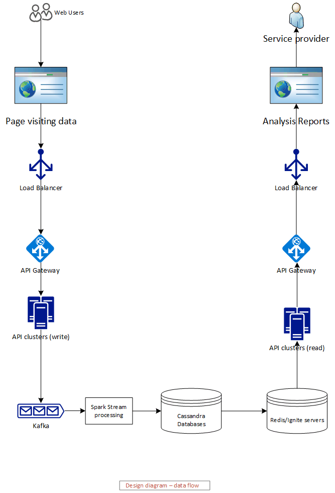

# Google Analytic Backend System Design - High Level

## Requirements Analysis

Requirement analysis result can be given in the following very concise way (please note the **bold** phrases): 

1. Handle large write volume: Billions of write events per day. -> **High performance for write**
2. Handle large read/query volume: Millions of merchants wish to gain insight into their business. Read/Query patterns are time-series related metrics. -> **High performance for read** and **Event**
3. Provide metrics to customers with at most one hour delay. -> **low latency**
4. Run with minimum downtime. -> **High availability**
5. Have the ability to reprocess historical data in case of bugs in the processing logic. -> **Rollback and replay capabilities**

## Overall Design
Based on above analysis result, to satisfy the requirement, the Backend system should have the following capabilities: 

1. High availability 
2. High throughput of read and write
3. Low latency between write and read 
4. Rollback and replay capabilities for time series event

To provide above capabilities, The Google Analytic backend system design 

* can use the **clusters and distribution system** to provide "high availability";

* can implement the Command Query Responsibility Segregation (**CQRS**) design pattern to provide separation of read and write and finally to provide high throughput for both write and read when combine with **clusters and distribution system**.

* can use **Streaming processing** and **Distributed Database** to implement low latency between write and read

* can implement **Event Sourcing** design pattern to provide event persistence, event roll back and replay capabilities for time series event

## High Level Detailed Design
The high level design of Google Analytic system can be illustrated in the following diagram which provides the data flow and components structure of Google Analytic Backend System :

* Load balancer

>using load balancers to improve the performance and reliability of a server environment by distributing the workload across multiple servers. In case of one server is down, it can redirect traffic to other servers. In this way, the Load Balancer not only provide high throughput, but also provide high availability. There are many open source and commercial products such as HAProxy and F5 which can be used in this system; 

* API gateway

>API gateway can be used for reverse proxy, Authentication/Identity management and Rate limiting. Depends on which cloud environment will be used, for example if the system will be deployed on AWS or Azure, API gateway such as AWS or Azure API gateway also have Load Balancer capabilities

* API Microservices (write) clusters servers 

>Microservices (write) will convert users page visiting data into time series events and write Events into event source system like Kafka, we can use Spring Boot application to implement this Microservice and deploy the microservice to the container clusters such as Kubernetes for high availability and high performance

* Kafka 

>Kafka message system can process trillions events a day, it's quite nature to choose it for meeting the requirement of "billion writes a day". In addition, since Kafka can also persist events and replay events in cased of error, it's also good to use it for implementing Event Sourcing design pattern to meet the requirement "reprocess historical data in case of bugs"

* Spark 

>Stream processing can provide almost real time processing speed to process event stream which comes from Kafka servers. Therefore it's good choice to use it to process Kafka events and convert the events into the data for queries and analysis. The processed information will be stored into Cansandra No SQL database for analysis report generation and query

* Cansandra 

>Cansandra No SQL database distributed services are used as read database in CQRS pattern. due to the features it provided such as no down time, distributed, high performance, it can be used as read database for query and reporting purpose

* Redis

> Redis can be used as cache server for further improving query performance

* API Microservices (Read) clusters servers 

>Microservice(read) as search reporting engine can be served to clients query requests. We can use Spring Boot application to implement the microservice and deploy the microservice applicaiton to the container clusters such as Kubernetes for high availability and high performance