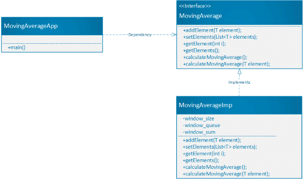

# Moving Average Calculation

## Overview

The Moving Average Calculation is implemented in Java language. 
The following locations contains java source codes regarding to Moving Average Calculation.
 
>The main source codes are located in the folder: [../src/main/java](../src/main/java). 

>The unit test source codes are located in the folder: [../src/test/java](../src/test/java)

The source codes can be test, built and run via Maven. 

## Design and implementation 

The following class diagram shows the java classes relationship for Moving Average Calculation: 

### Interface
The interface **MovingAverage<T>** provides following methods: 

   1. Assign a list of elements
   2. Add a new element in the data structure and calculate
   3. Access one element at the specific location
   4. Access all elements 
   5. Calculate moving average of the last N elements in a list 
   6. Calculate moving average of the last N elements when add a new element 

### Implementation
 The class **MovingAverageImpl** implements the interface **MovingAverage**: 

To improve the efficiency for the calculation, the implementation class uses the **Sliding Window Algorithm** to calculate the Moving Average. 

The class **MovingAverageImpl** use a queue to represent the sliding window, and the queue's size equals to the size of last N elements.

Using the **Sliding Window Algorithm**, the time complexity is O(n). Using a queue to represent the sliding window will use additional constant amount of space which depends on the size of last N elements.

### How to Use
  The MovingAverageApp class is the main entry point for using MovingAverage classes. It provide 3 examples with different ways to call MovingAverage 
  
  1. Calculation of Moving Average after a list of elements are assigned, the following is the example snippet:      
  
	    int window_size = 3; 
	    List<Double> list = Arrays.asList(1.0, 2.0, 3.0, 4.0, 5.0, 6.0, 7.0, 8.0);    
		MovingAverage<Double> movingAverage_list = new MovingAverageImpl(window_size);
		movingAverage_list.setElements(list);
		List<Double> averageList = movingAverage_list.calculateMovingAverage();	             
        averageList.stream()
		           .forEach(x -> System.out.println("moving average for last " 
	   	                         + window_size + " elements: " + x));

   2. Calculation of Moving Average when a sequence of elements are added one by one, the following is the example snippet:      
  	   	 
	   	MovingAverage<Double> movingAverage_sequence = new MovingAverageImpl(window_size);
	   	System.out.println(movingAverage_sequence.addElement(1d));
	   	System.out.println(movingAverage_sequence.addElement(2d));
	   	System.out.println(movingAverage_sequence.addElement(3d));
	   	System.out.println(movingAverage_sequence.addElement(4d));
	   	System.out.println(movingAverage_sequence.addElement(5d));
	   	System.out.println(movingAverage_sequence.addElement(6d));
	   	System.out.println(movingAverage_sequence.addElement(7d));
	   	System.out.println(movingAverage_sequence.addElement(8d));

   3. Calculation of Moving Average in a Stream, the following is the example snippet:  		
    
	   	MovingAverage<Double> movingAverage_stream = new MovingAverageImpl(window_size);
	   	list.stream()   	     
	   	     .map(a -> movingAverage_stream.calculateMovingAverage(a))
	   	     .filter(b -> b != null)
	   	     .forEach(c -> System.out.println(c));
	   	     
## Possible Enhancement
In the more complex environment, the Spring or CDI Frameworks may be used for injecting implementation classes to decouple implementation classes and calling classes. 	   	     